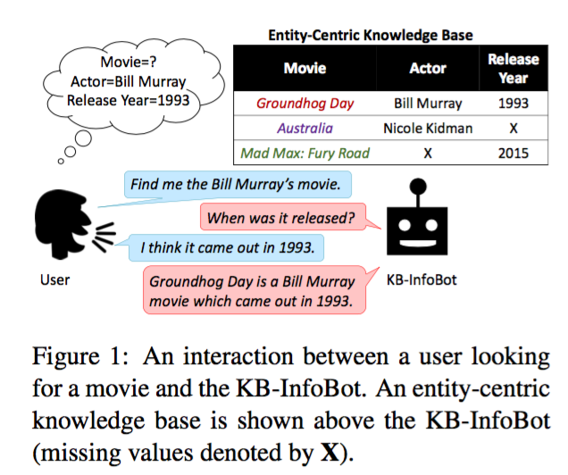
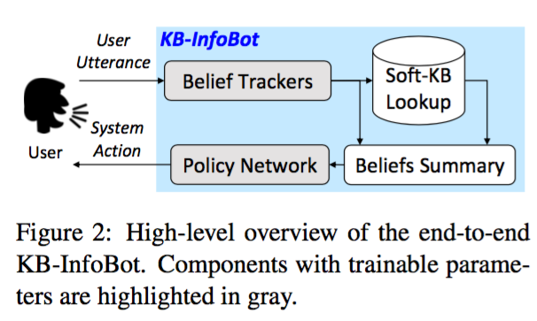
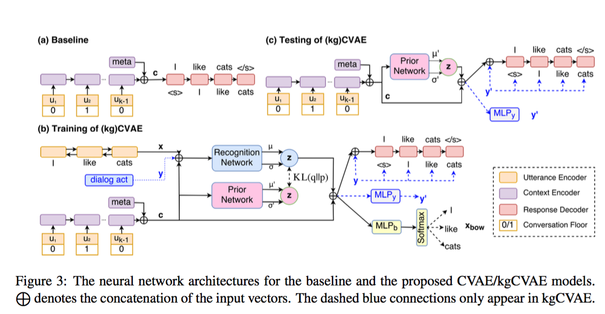
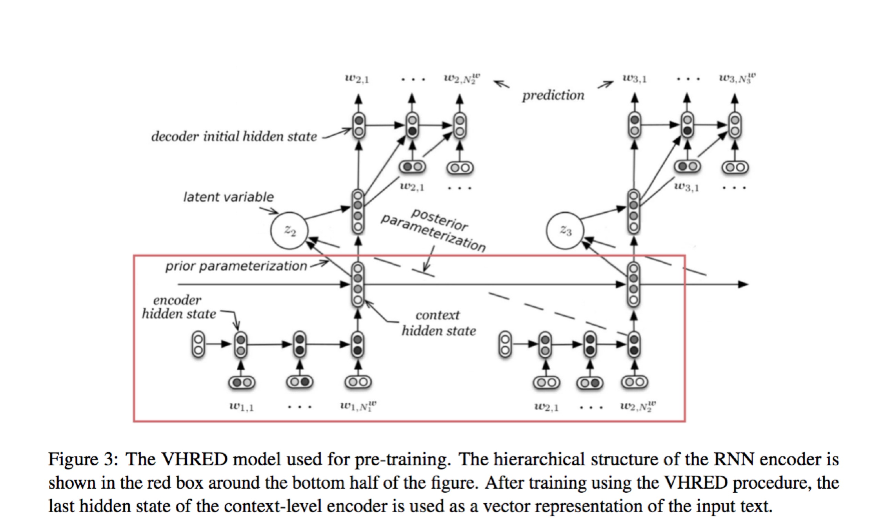
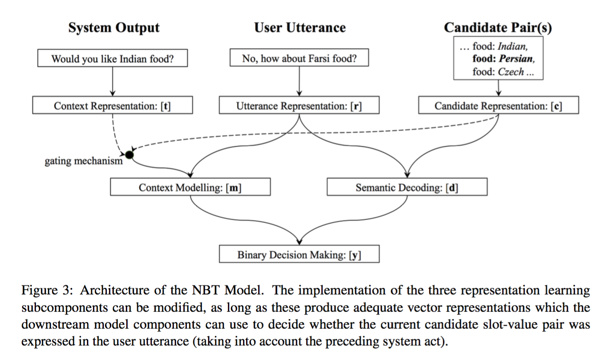

# Dialog generation & Chatbot

## Zewei Chu

## Summaries
- How to generate dialog: Seq2Seq, reinforcement learning with policy gradient
- Dialog diversity: Conditional variational autoencoder
- Knowledge base: soft posterior over the KB
- State tracking: 
- Dialog evaluation: BLEU(not so good), Adem, 

## In ACL 2017

## [Towards End-to-End Reinforcement Learning of Dialogue Agents for Information Access](http://aclweb.org/anthology/P/P17/P17-1045.pdf)

- a multi-turn dialogue agent which helps users search Knowledge Bases (KBs) without composing complicated queries. 
- replace symbolic queries with an induced “soft” posterior distribution over the KB that indicates which entities the user is interested in.

### Background

How a Knowledge base bot typically works: semantic parsing on the input to construct a symbolic query and query on the knowledge base. Drawback of this method is that:
1. the retrieved results do not carry any information about uncertainty in semantic parsing, and 
2. the retrieval operation is non differentiable, and hence the parser and dialog policy are trained separately.

### Model

Knowledge base: rows correspond to the unique head entities, columns correspond to the unique relationship types, and some entries may be missing. 

- a belief tracker module for identifying user intents, extracting associated slots, and tracking the dialogue state
- an interface with the database to query for relevant results
- a summary module to summarize the state into a vector
- a dialogue policy which selects the next system action based on current state

### Experiment

### Comments

### Related work

- [A User Simulator for Task-Completion Dialogues](https://arxiv.org/abs/1612.05688)
- [A Network-based End-to-End Trainable Task-oriented Dialogue System](https://arxiv.org/abs/1604.04562)

---

## [Learning Discourse-level Diversity for Neural Dialog Models using Conditional Variational Autoencoders](http://aclweb.org/anthology/P/P17/P17-1061.pdf)

a novel framework based on conditional variational autoencoders that captures the discourse-level diversity in the encoder

### Model

- the model uses latent variables to learn a distribution over potential conversational intents and generates diverse responses using only greedy decoders. 
- use CVAE instead of Seq2Seq to generate diverse utterances
- use linguistic features as extra hidden variable to generate responses
- introduce bag of words loss to fight vanishing latent variable problem

### Experiment

### Comments

---

## [Hybrid Code Networks: practical and efficient end-to-end dialog control with supervised and reinforcement learning ](http://aclweb.org/anthology/P/P17/P17-1062.pdf)

- Hybrid Code Networks (HCNs) combines an RNN with domain-specific knowledge encoded as software and system action templates. 
- HCNs attain state-of-the-art performance on the bAbI dialog dataset (Bordes and Weston, 2016), and outperform two commercially deployed customer-facing dialog systems.

### Model

### Experiment

### Comments

---

## [Towards an Automatic Turing Test: Learning to Evaluate Dialogue Responses](http://aclweb.org/anthology/P/P17/P17-1103.pdf)

This paper presents an evaluation model (ADEM) that learns to predict human-like scores to input responses, using a new dataset of human response scores

### Dataset
- collect a dataset of human judgements (scores) of Twitter responses using the crowdsourcing platform 
- use the following 4 sources of candidate responses: (1) 
a response selected by a TF-IDF retrieval-based model, (2) a response selected by the Dual Encoder (DE) (Lowe et al., 2015), (3) a response generated using the hier- archical recurrent encoder-decoder (HRED) model (Serban et al., 2016a), and (4) human-generated responses. 

### Model

- hierarchical RNN to predict human scores: ADEM learns distributed representations of the context, model response, and reference response using a hierarchical RNN encoder. 

- we train the encoder as part of a neural dialogue model.

### Experiment

### Comments

---

[Joint Modeling of Content and Discourse Relations in Dialogues](http://aclweb.org/anthology/P/P17/P17-1090.pdf)

[Learning Symmetric Collaborative Dialogue Agents with Dynamic Knowledge Graph Embeddings](http://aclweb.org/anthology/P/P17/P17-1162.pdf)

We collected a dataset of 11K human-human dialogues, which exhibits interesting lexical, semantic, and strategic elements.
a template-based model and a sequence-to-sequence based neural generative model. 
a neural model with dynamic knowledge graph embeddings that evolve as the dialogue progresses

---

## [Neural Belief Tracker: Data-Driven Dialogue State Tracking](http://aclweb.org/anthology/P/P17/P17-1163.pdf)

belief tracker: estimates the user's goal at every step of the dialog. The dialogue state tracking (DST) component of an SDS serves to interpret user input and update the belief state, which is the system’s internal representation of the state of the conversation.

Neural Belief Tracking (NBT): reason over pre-trained word vectors, learning to compose them into distributed representations of user utterances and dialogue context. 

### Model

The proposed models couple SLU and DST, efficiently learning to handle variation without requiring any hand-crafted resources.

### Comments

---

[Are you asking the right questions? Teaching Machines to Ask Clarification Questions](http://aclweb.org/anthology/P/P17/P17-3006.pdf)
how can we teach machines to ask clarification questions when faced with uncertainty

## In EMNLP 2017 

Affordable On-line Dialogue Policy Learning

Agent-Aware Dropout DQN for Safe and Efficient On-line Dialogue Policy Learning

Adversarial Learning for Neural Dialogue Generation
Jiwei Li’s paper

Generator (SEQ2SEQ) generates utterance
Discriminator labels dialogue as human or machine generated

