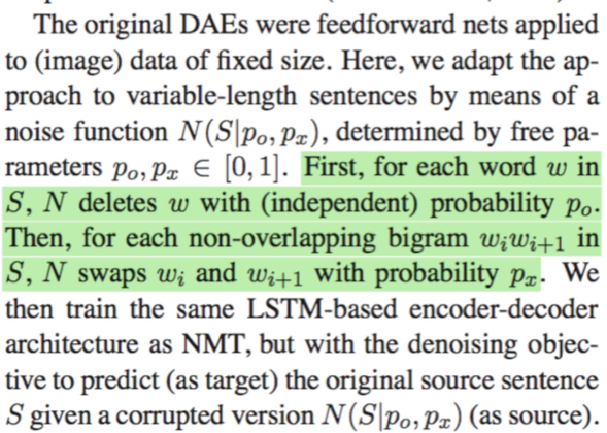
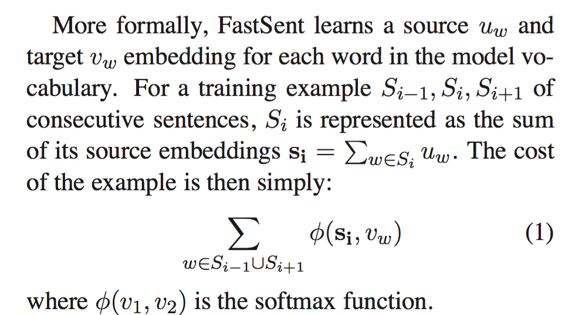
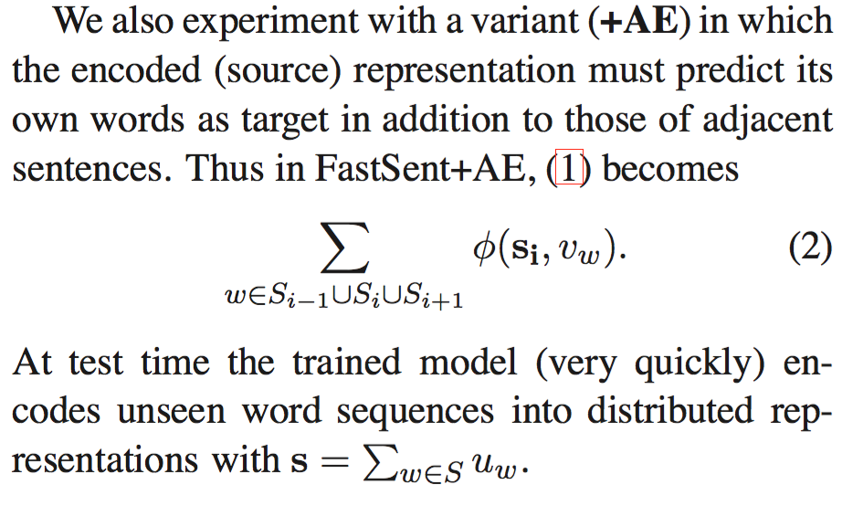

# Embedding

## Zewei Chu

## Summaries

# arXiv

## [Learning Distributed Representations of Sentences from Unlabelled Data](https://arxiv.org/abs/1602.03483)

Deeper, more complex models are preferable for representations to be used in supervised systems, but shallow log-linear models work best for building representation spaces that can be decoded with simple spatial distance metrics. 

## Existing Models

- SkipThought: 

## Sequential Denoising Autoencoders

## FastSent

## [Fine-Grained Analysis of Sentence Embeddings usning Auxiliary Prediction Tasks](https://arxiv.org/pdf/1608.04207.pdf)

## [LSTM Neural Reordering Feature for Statistical Machine Translation](http://www.aclweb.org/anthology/N16-1112)

## [A Dependency-Based Neural Reordering Model for Statistical Machine Translation](https://arxiv.org/pdf/1702.04510.pdf)

## [Deep Sentence Embedding Using Long Short-Term Memory Networks: Analysis and Application to Information Retrieval](https://arxiv.org/pdf/1502.06922.pdf)

## [Sentence Ordering Using Recurrent Neural Networks](https://openreview.net/pdf?id=S1AG8zYeg)

## [One Model To Learn Them All](https://arxiv.org/pdf/1706.05137.pdf)

# Evaluation of Word Vector Representations by Subspace Alignment

We present QVEC — a computationally inexpensive intrinsic evaluation measure of the quality of word embeddings based on alignment to a matrix of features extracted from manually crafted lexical resources — that obtains strong correlation with performance of the vectors in a battery of downstream semantic evaluation tasks

quantifying the similarity between a distributional word vector model and a (gold-standard) linguistic resource capturing human knowledge

## Comments
Qvec provides an approach to align learned word vector dimensions with linguistic annotated dimensions by correlations.

# Evaluation methods for unsupervised word embeddings

# In ACL 2017

# In EMNLP 2017

