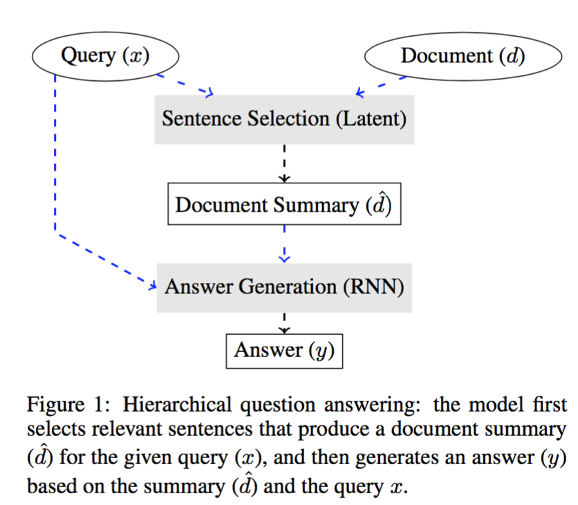
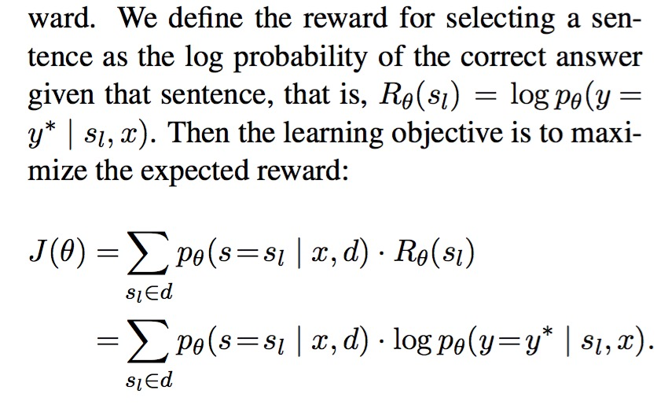
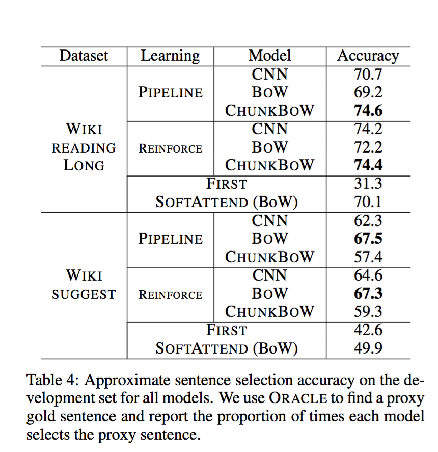
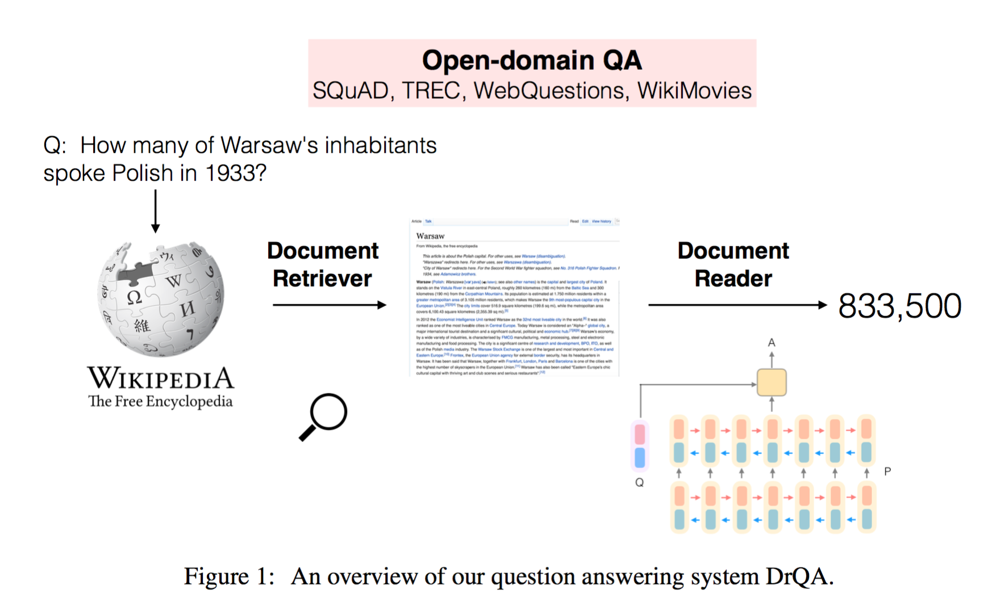
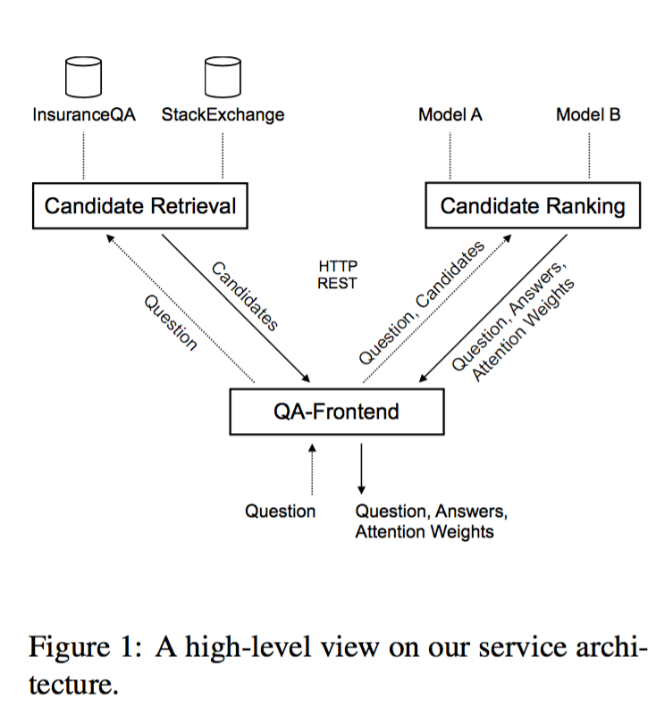
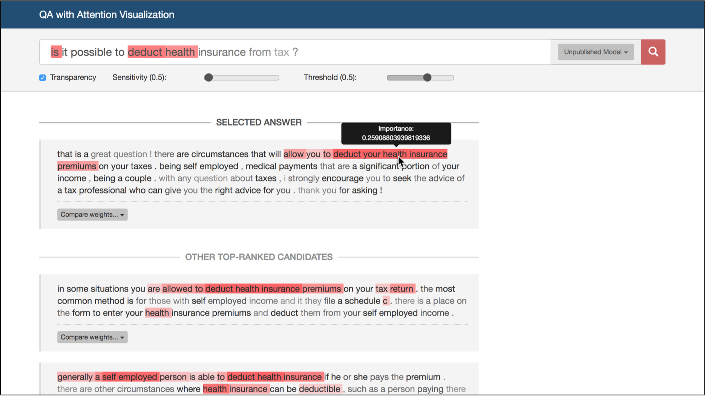

# Question Answering

## Zewei Chu

## Highlights

- Knowledge based question answering, using external knowledge for question answering (Wikipedia). 
- Answer questions with longer document
- Knowledge representation, in my opinion, is the key to answer questions of open-domain or long documents. 
- Transfer learning in question answering on different datasets
- Systems: Attention visualization system. 

# In ACL 2017

## [Question Answering through Transfer Learning from Large Fine-grained Supervision Data](http://aclweb.org/anthology/P/P17/P17-2081.pdf)

### Dataset
- Pretrain on SQuAD, evaluate on WikiQA and SemEval 2016 (Task 3A)
- WikiQA: classify whether each sentence provides the answer to the query
- SemEval: classify whether each comment is relevant to the question.
- SICK: recognizing textual entailment (RTE)

### Model
#### [BiDAF](https://arxiv.org/pdf/1611.01603.pdf)

- inputs: question q, context paragraph x
- outouts: the best answer span

#### [code](https://allenai.github.io/bi-att-flow/)

### Experiment results

### Comments

This papers elaborate the method to apply transfer learning in question answering on different datasets. 

---
---

## [Coarse-to-Fine Question Answering for Long Documents](http://aclweb.org/anthology/P/P17/P17-1020.pdf)

combine a coarse, fast model for selecting relevant sentences and a more expensive RNN for producing the answer from those sentences. sentence selection as a latent variable trained jointly from the answer only using reinforcement learning.

### Dataset
- [Wiki reading dataset](https://www.aclweb.org/anthology/P/P16/P16-1145.pdf)
- given question, document, predict the answer. 

### Model

#### fast model for selecting relevant sentences (a distribution over sentences) given the input question x and the document d. 
- BoW model
- Chuncked BoW model
- Convolutional neural network model
- Create a summary from the document either by hard attention (sampling) or soft attention (weighted sum of word vectors). 

#### expensive answer generation model for producing the answer from those sentences.
- Generate the answer with [attention based model](https://www.aclweb.org/anthology/P/P16/P16-1145.pdf).

### Learning
- Distant supervision: set the gold sentence to be the first sentence containing the answer string, then train two models. 
- Reinforcement Learning

To reduce variance, they use curriculum learning, to first start with distant supervision, then switch to REINFORCE. 
- soft attention

### Experiments

### Comments
I like the part of using reinforcement learning to train two models together the best. 

---
---

## [An End-to-End Model for Question Answering over Knowledge Base with Cross-Attention Combining Global Knowledge](http://aclweb.org/anthology/P/P17/P17-1021.pdf)

represent the questions and their corresponding scores dynamically according to the various candidate answer aspects via cross-attention mechanism.
Contributions: 1. a novel cross-attention based NN model tailored to KB-QA task, which considers the mutual influence between the representation of questions and the corresponding answer aspects. 2. We leverage the global KB information, aiming at represent the answers more precisely. It also alleviates the OOV problem, which is very helpful to the cross-attention model. 3. The experimental results on the open dataset WebQuestions demonstrate the effectiveness of the proposed approach. 

### Model
- First, we identify the topic entity of the question, and generate candidate answers from Freebase. 
- Then, a cross-attention based neural network is employed to represent the question under the influence of the candidate answer aspects. 
- Finally, the similarity score between the question and each corresponding candidate answer is calculated, and the candidates with highest score will be selected as the final answers

### Experiment
Freebase API to select candidate answers. Introduce answer-towards-question attention and question-towards-answer attention. 

## [Learning to Ask: Neural Question Generation for Reading Comprehension](http://aclweb.org/anthology/P/P17/P17-1123.pdf)

attention-based sequence learning model for the task and investigate the effect of encoding sentence- vs. paragraph-level information

---

## [Search-based Neural Structured Learning for Sequential Question Answering](http://aclweb.org/anthology/P/P17/P17-1167.pdf)

Task: answering sequences of simple but inter-related questions. semantic parsing for answering sequences of simple related questions
Dataset: WikiTableQuestions(http://www.cs.stanford.edu/people/ppasupat/resource/ACL2015-paper.pdf : answering complex questions on semi-structured tables using question-answer pairs as supervision.)

---

## [Reading Wikipedia to Answer Open-Domain Questions](http://aclweb.org/anthology/P/P17/P17-1171.pdf)

Open-domain question answering using Wikipedia as the unique knowledge source. 

### Model

The model combines a search component based on bigram hashing and TF-IDF matching with a multi-layer recurrent neural network model trained to detect answers in Wikipedia paragraphs

- the Document Retriever module for finding relevant articles and 
- a machine comprehension model, Document Reader, for extracting answers from a single document or a small collection of docu- ments.

1. Document Retriver to retrive relevant articles. Articles and questions are compared as TF-IDF weighted bag-of-word vectors and n-gram features. 

2. Document Reader: attentive reader. 

### Comments

The task is similar to [Coarse-to-Fine Question Answering for Long Documents](http://aclweb.org/anthology/P/P17/P17-1020.pdf). The search space of Wiki document is even bigger than a long document. 

---
## [Improved Neural Relation Detection for Knowledge Base Question Answering](http://aclweb.org/anthology/P/P17/P17-1053.pdf)

---

## [End-to-End Non-Factoid Question Answering with an Interactive Visualization of Neural Attention Weights](http://aclweb.org/anthology/P/P17/P17-4004.pdf)

- an extensible, highly modular service architecture that enables the transformation of neural network models for non-factoid answer selection into fully featured end-to-end question answering systems
- the system enables researchers a way to interactively explore and compare attention based neural networks for answer selection

### System

This work is a good visualization system for attention based QA models. 

[code](https://github.com/UKPLab/acl2017-non-factoid-qa)

# In EMNLP 2017

## [Two-Stage Synthesis Networks for Transfer Learning in Machine Comprehension](https://arxiv.org/pdf/1706.09789.pdf)

Given a high-performing MC model in one domain, our technique aims to answer questions about documents in another domain, where we use no labeled data of question-answer pairs.

we address this problem in MC through a two-stage synthesis network (SynNet). The SynNet generates synthetic question-answer pairs over paragraphs in a new domain that are then used in place of human-generated annotations to finetune a MC model trained on the original domain.

## Method

In our approach, we decompose the process of generating question-answer pairs into two steps, answer generation conditioned on the paragraph, and question generation conditioned on the para- graph and answer. We generate the answer first be- cause answers are usually key semantic concepts, while questions can be viewed as a full sentence composed to inquire the concept.

